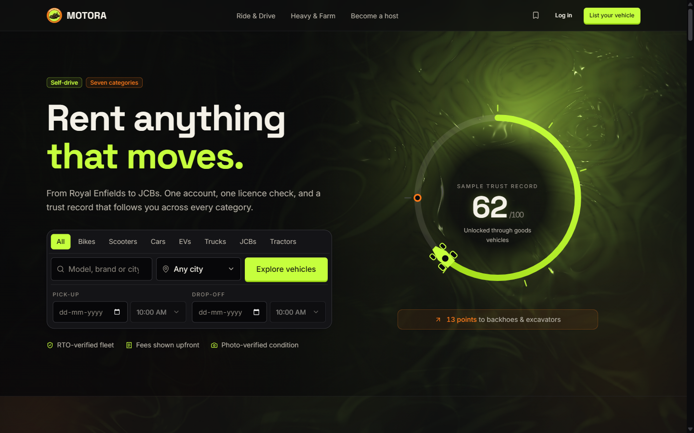
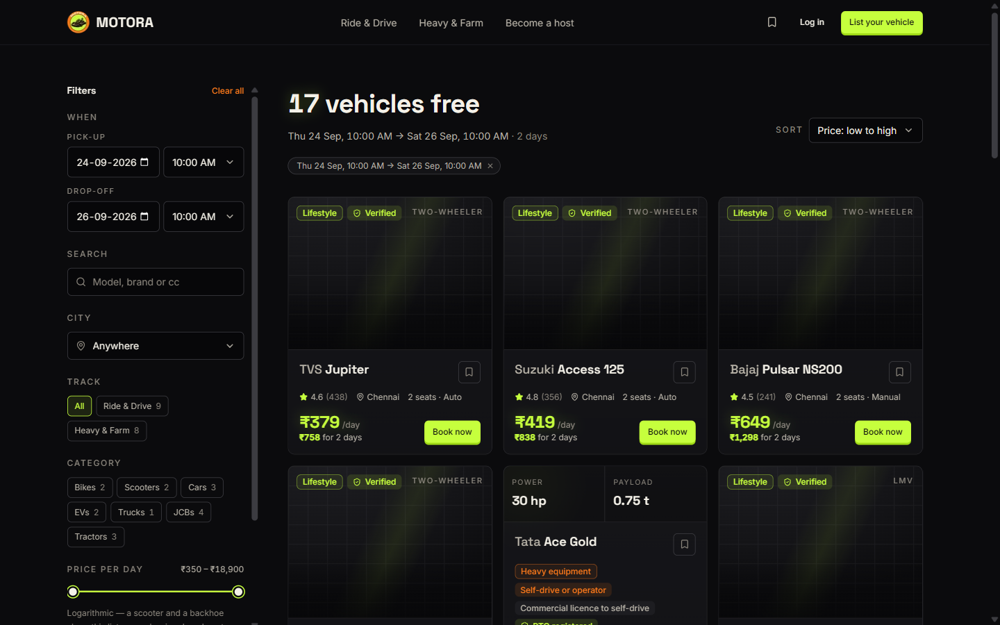
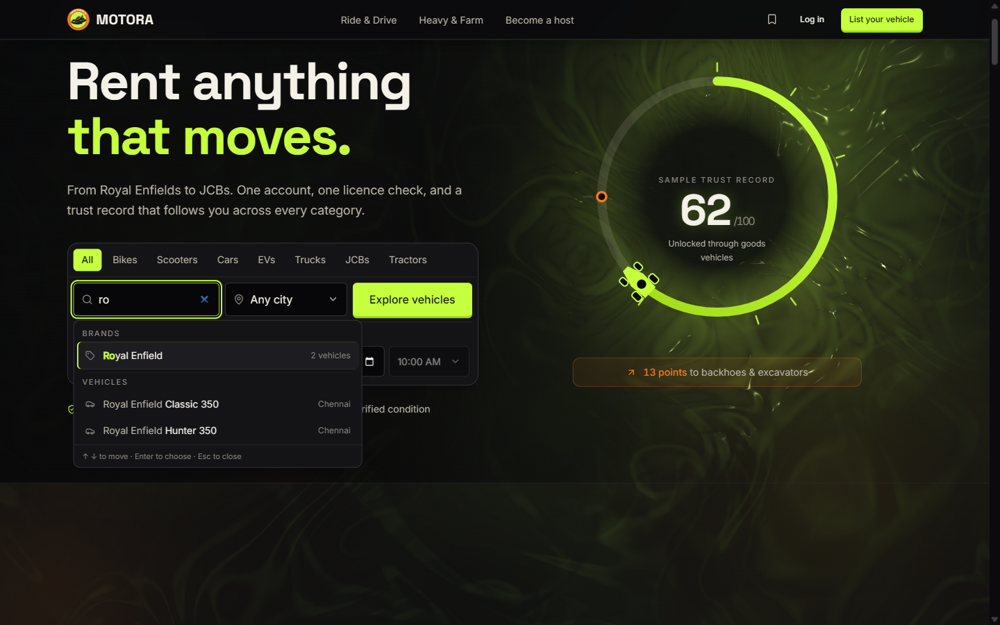
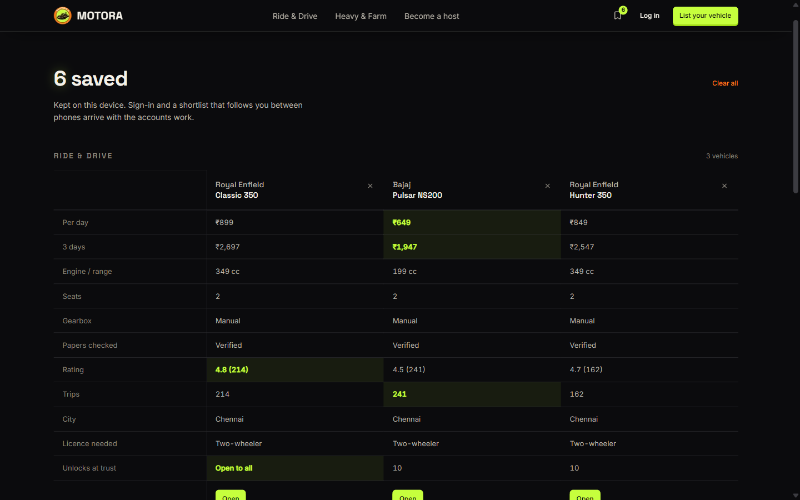
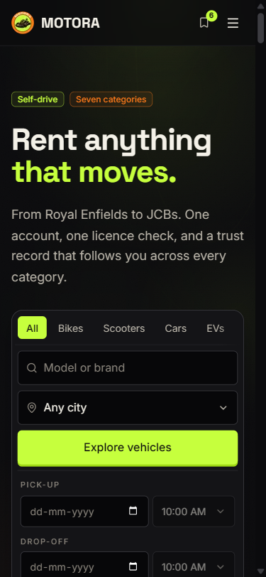
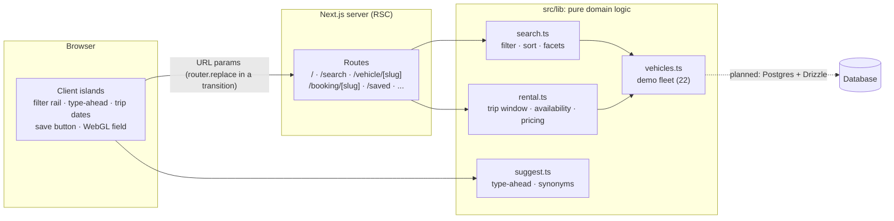

<p align="center">
  
</p>

<h1 align="center">MOTORA</h1>

<p align="center">
  <strong>Rent anything that moves.</strong><br />
  Scooters to backhoes, one account, one licence check, and a trust record that follows you across every category.
</p>

<p align="center">
  <a href="https://motora-preview.onrender.com"><strong>Live demo</strong></a> ·
  <a href="docs/ARCHITECTURE.md">Architecture</a> ·
  <a href="docs/ALGORITHMS.md">Algorithms</a> ·
  <a href="docs/DESIGN-SYSTEM.md">Design system</a> ·
  <a href="docs/DECISIONS.md">Decisions</a> ·
  <a href="docs/ROADMAP.md">Roadmap</a>
</p>

<p align="center">
  
</p>

> **Status:** investor demo and portfolio build. The whole renter journey is
> real, working software, but no booking is created and no payment is
> processed. Inventory is a demo fleet of 22 vehicles across 5 Indian cities.
> The live demo runs on a free server that sleeps when idle, so the first
> load can take about 50 seconds.

---

## The problem

Renting a vehicle in India means a different company for every kind of
vehicle: one app for a scooter, another for a car, a phone call for a
tractor, a broker for a JCB. Each makes you verify again from zero, and each
fails in the same documented ways: fees that appear only at checkout, deposit
disputes with no evidence either way, and a chatbot where a person should be
when something goes wrong mid-rental.

## The approach

**Seven categories, two tracks, one account.**

| Track | Categories | How it rents |
|---|---|---|
| **Ride & Drive** | Bikes, scooters, cars, EVs | Self-drive, by the hour, day or week |
| **Heavy & Farm** | Trucks, JCBs and excavators, tractors | Self-drive **or** with an operator, chosen at booking; by 8-hour shift, day or week; always delivered to site |

One licence check is reused everywhere. A **trust record** carries across
categories: a clean history unlocks bigger machines, the way a credit score
unlocks larger loans. Every design choice is made against a specific failure
in the ten-platform competitor research (see [Decisions](docs/DECISIONS.md#research-basis)).

## What works today

- **Search by where and when**: city, pick-up and drop-off in half-hour slots
  inside hub hours. Results show only vehicles free for that window, each priced
  as a **trip total**, always on the cheapest billing (hourly, daily, weekly or
  per shift).
- **Type-ahead** in the style of Cars24 and OLX: grouped suggestions with counts,
  recent and most-booked searches, and the words Indians actually type ("scooty",
  "bullet", "backhoe", "Bangalore").
- **Filters in the URL**, so any filtered view is a shareable link: category,
  track, city, a logarithmic price range, verified-only, and "unlocked at my
  trust score". Each option shows how many results it would give.
- **Save and compare**: a shortlist that works across tabs, and a side-by-side
  table that highlights the real winner in each row and nothing else.
- **Trust gating**: vehicles above the demo account's score show as locked, with
  the points needed to unlock them.
- **Vehicle pages**, a booking-sequence preview, a host landing page, and
  about, FAQ, help, contact, terms and privacy pages. No link leads nowhere.
- **A lit, animated background** (WebGL), with text contrast **measured** at
  every breakpoint: never below 8.6:1 on the hero copy.

<table>
  <tr>
    <td width="50%"></td>
    <td width="50%"></td>
  </tr>
  <tr>
    <td></td>
    <td align="center"></td>
  </tr>
</table>

**Not built yet** (specified in the [Roadmap](docs/ROADMAP.md)): the booking
steps themselves, sign-in, the database, and maps. Payments will only ever
run in test mode.

## Tech stack

| Layer | Choice | Why |
|---|---|---|
| Framework | **Next.js 16** (App Router, Turbopack), **React 19** | Server-rendered results pages for search engines, with client code only where there is interaction |
| Language | **TypeScript** (strict) | The domain logic is pure functions with typed contracts, ready to swap onto a database |
| Styling | **Tailwind CSS 4** with CSS custom-property tokens | One token source (`src/app/globals.css`), dark-only |
| Motion | **GSAP + ScrollTrigger**, **Lenis** | Scroll-scrubbed parallax on one timeline; smooth scroll driven by GSAP's ticker |
| Graphics | **ogl** (about 30 KB) WebGL | A custom lighting shader at a fraction of three.js's weight; the page is demoed live, so load time is a hard requirement |
| Icons | lucide-react | |
| Hosting | Render (auto-deploys on push to `main`) | |
| Planned | PostgreSQL + Drizzle, NextAuth (phone OTP + Google), Razorpay in test mode, Playwright + Vitest | See [Roadmap](docs/ROADMAP.md) |

## Architecture at a glance



Filters live in the URL, so every search is a link, the back button behaves,
and the results are rendered on the server, meaning search engines see
exactly what people see. The domain logic in `src/lib` has no React in it and
takes its inventory as an argument, so moving to a database replaces a
function body, not the pages. Details in [Architecture](docs/ARCHITECTURE.md).

## Getting started

Requires **Node.js 20.9 or newer**.

```bash
git clone https://github.com/subaselvan/motora.git
cd motora
npm install
npm run dev          # http://localhost:3000
```

```bash
npm run build        # production build
npx tsc --noEmit     # type check
npm run lint         # ESLint, zero warnings expected
```

No environment variables are needed: the demo has no backend yet.

## Project structure

```
src/
  app/                  routes (App Router): home, search, vehicle, booking, saved, info pages
    globals.css         design tokens and component CSS: the design system's source of truth
  components/
    sections/           homepage sections (hero, tracks, comparison, booking spine, ...)
    search/             filter rail, type-ahead, trip-date fields, search transition
    saved/              shortlist store hooks, save button, compare board
    ui/                 primitives (button, input, badge), WebGL field, split-text
  lib/
    vehicles.ts         demo fleet, categories, trust tiers
    search.ts           query parsing, filtering, sorting, facet counts
    rental.ts           trip windows, hub hours, availability, trip pricing
    suggest.ts          type-ahead ranking, Indian synonyms, recent searches
    store/              shortlist store (localStorage today, database later)
docs/                   architecture, algorithms, design system, decisions, roadmap
AGENTS.md               orientation for AI coding assistants working in this repo
```

## How quality is checked

Nothing is called done until it is verified in a real browser:

- **Contrast is measured, not eyeballed.** The WebGL frame is read pixel by
  pixel under every text element, with the legibility scrim composited on top,
  over several animation frames, keeping the worst. Hero copy: 8.79:1 on desktop,
  8.62:1 on tablet (WCAG AA needs 4.5).
- **No sideways scrolling**: nine main pages checked at a true 375px viewport.
- **Keyboard and screen reader**: the type-ahead follows the WAI-ARIA 1.2
  combobox pattern, and the compare view is a real `<table>` with row and
  column headers.
- **Reduced motion is respected** everywhere: the shader never mounts, and
  reveals and count-ups resolve instantly.
- Type check, lint (zero warnings) and a production build pass on every commit.

## Documentation

| Document | What's in it |
|---|---|
| [Architecture](docs/ARCHITECTURE.md) | How the app is put together, rendering strategy, state, and where the backend plugs in |
| [Algorithms](docs/ALGORITHMS.md) | Every non-trivial algorithm: search, facets, price scale, trip windows, availability, pricing, type-ahead, shader lighting, contrast measurement |
| [Design system](docs/DESIGN-SYSTEM.md) | Tokens, type, motion, elevation, and the rules behind them |
| [Decisions](docs/DECISIONS.md) | What was decided, when and why, plus what was removed on purpose |
| [Roadmap](docs/ROADMAP.md) | What's next, specified: booking flow, auth, database schema, and the algorithms still to come |
| [AGENTS.md](AGENTS.md) | Rules and pitfalls for any AI assistant continuing the work |

## License

Copyright © 2026 subaselvan. **All rights reserved.** The source is published
to be read, not reused; see [LICENSE](LICENSE).
