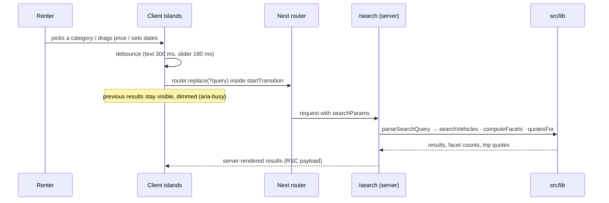

# Architecture

How MOTORA is put together, and where each future piece plugs in.

## Principles

1. **Domain logic is pure.** Everything in `src/lib` is plain TypeScript: no
   React, no DOM, no fetch. Functions take the inventory as an argument.
   Replacing the demo data with a database replaces function bodies, not
   callers.
2. **The server renders results; the client handles interaction.** Pages are
   React Server Components. Client components ("islands") exist only where
   there is interaction: the filter rail, type-ahead, date fields, save
   buttons, and the WebGL background.
3. **State lives where it belongs.** A filter is part of *where you are*, so
   it lives in the URL. A shortlist is *yours*, so it lives in your browser
   (and later your account). A dropdown's highlight is *momentary*, so it
   lives in component state.
4. **Measure, don't assume.** Contrast, overflow and behaviour are verified in
   a real browser before anything ships (see [Algorithms §9](ALGORITHMS.md#9-contrast-measurement)).

## Layers

```
┌──────────────────────────────────────────────────────────────┐
│ Routes (src/app)                     Server Components        │
│   / · /search · /vehicle/[slug] · /booking/[slug] · /saved    │
│   /login · /host-landing · /about /faq /help /contact ...     │
├──────────────────────────────────────────────────────────────┤
│ Client islands (src/components)                               │
│   search/  filter-bar · search-combobox · trip-window-fields  │
│            search-transition (shared pending state)           │
│   saved/   save-button · saved-board · use-saved              │
│   ui/      ambient-field (WebGL) · split-text · count-up      │
├──────────────────────────────────────────────────────────────┤
│ Domain (src/lib), pure and swappable                          │
│   vehicles.ts   fleet, categories, trust tiers                │
│   search.ts     parse/serialise query, filter, sort, facets   │
│   rental.ts     trip window, hub hours, availability, pricing │
│   suggest.ts    type-ahead ranking, synonyms, recent searches │
│   store/saved-store.ts  external store (localStorage)         │
├──────────────────────────────────────────────────────────────┤
│ Data: in-memory demo fleet today → PostgreSQL (planned)       │
└──────────────────────────────────────────────────────────────┘
```

## Rendering strategy

From the production build:

| Route | Mode | Why |
|---|---|---|
| `/`, `/saved`, `/login`, `/host-landing`, info pages | Static | Content doesn't depend on the request |
| `/vehicle/[slug]`, `/booking/[slug]` | Static, pre-rendered per vehicle (`generateStaticParams`) | 22 fast pages; the trip window arrives as query params |
| `/search` | Dynamic (rendered per request) | Results depend on the query string |

## The search request, end to end



- **`router.replace`, not `push`**: adjusting a filter refines where you are.
  Pushing would bury the previous page under twenty history entries.
- **`useTransition`** keeps the old results on screen while the new ones
  render, instead of flashing to a spinner.
- The query is parsed **once, on the server**, and passed to client
  components as props, so the client never re-parses and drifts.

## State

| State | Where it lives | Why |
|---|---|---|
| Filters, sort, trip window | URL query string | Shareable, crawlable, survives reloads |
| Shortlist (saved vehicles) | `localStorage` via an external store read with `useSyncExternalStore` | Pages stay server-rendered; only the components that read it are client code. Syncs across tabs through the `storage` event |
| Recent searches | `localStorage` (5 entries) | Read only when the search box is focused |
| Half-entered dates, dropdown highlight | Component state | Momentary: half a trip window isn't a search |

Every `localStorage` access is wrapped in `try/catch`: it throws in Safari
private windows, and a convenience feature must never break the page.

## Where the backend plugs in

| Today | Tomorrow | What changes |
|---|---|---|
| `VEHICLES` array | `vehicles` table | `searchVehicles`, `computeFacets` bodies become queries |
| `isAvailable()` over a demo calendar | `bookings` table with a range exclusion constraint | Only `isAvailable` |
| `PRICING` constants | `pricing_rules` table / admin | Only `quoteTrip`'s inputs |
| `saved-store.ts` on localStorage | `saved_vehicles` table behind the signed-in user | Only the store; hooks and components unchanged |
| `suggest()` in the browser | `/api/suggest` over a search index | Only the data source; the result shape is the API contract |
| `DEMO_TRUST_SCORE = 62` | `trust_events` log → computed score | Card gating reads the same number |

The proposed schema is in the [Roadmap](ROADMAP.md#database-schema-proposed).

## Background and motion system

```
AmbientBackdrop (fixed, behind everything, z -10)
├─ AmbientField: ogl WebGL shader (opaque pass)
│    light source measured from [data-light-anchor] on the trust ring
├─ CSS mesh blobs · contour · aura (emission core + bounce) · grain
└─ one GSAP ScrollTrigger timeline scrubs every layer's parallax
     └─ Lenis smooth scroll, driven by gsap.ticker (one clock)
```

- **Capability gate.** The shader mounts only at ≥768px, with more than 4 GB
  device memory, and without `prefers-reduced-motion`. Pixel density is capped
  at 1.5 and the loop stops when the tab is hidden. Below that, the CSS layers
  alone render the field.
- **One clock.** Lenis runs on GSAP's ticker and feeds `ScrollTrigger.update`,
  so smooth scroll and scroll-scrubbed motion can't drift apart.
- **Reveals** use one IntersectionObserver (`reveal-driver.tsx`) rather than
  CSS scroll timelines, so content can never be stranded at opacity 0 in a
  browser that lacks the feature.

## Accessibility architecture

- Type-ahead: WAI-ARIA 1.2 combobox (`aria-activedescendant`, grouped
  options, Enter only intercepted when an option is highlighted).
- Compare view: a real `<table>` with `scope="col"`/`scope="row"`, and a
  sticky label column.
- Headlines animate as words, never characters. The original text stays in
  the DOM as `sr-only` and the animated copy is `aria-hidden`.
- A search error is announced once, from the results header (`role="alert"`),
  not repeated by each copy of the filter rail.
- Native controls where the platform does better: `<details>` for the mobile
  filter panel and FAQ, `<select>` for city and time slots, a date input for
  dates.
